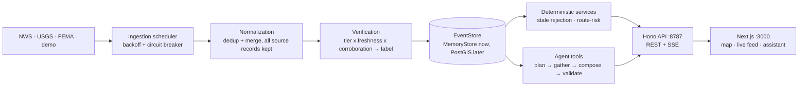

# Harborline (Best Use of the Agent @ Sentient Labs Hackathon)

<p align="center">
  
</p>

**Calm, verified answers when everything else is chaos.** Official alerts, open shelters, road risk, and an evidence-backed assistant for Seattle — in one view designed for a person under stress.

Disaster information is scattered across agency feeds, news, and social posts, and the tools that aggregate it tend to hallucinate exactly when accuracy matters most. Harborline inverts the usual AI architecture: it ingests official emergency feeds into one canonical geospatial event model with provenance and freshness on every record, and the language model is only allowed to restate what those records actually say. **The database determines facts. The model explains them.** A shelter is "open" because Seattle Emergency Management verified it 8 minutes ago — never because a model guessed.

Built for the **Sentient Labs Hackathon**, where it won **Best Use of the Agent**.

<p align="center">
  
</p>

<p align="center">
  <i>Best Use of the Agent — Jacob Frans, Kshitij Rao, Gurucharan Lingamallu, Hemkesh Bandi</i>
</p>

## What Harborline does

1. **Ingest official sources.** Connectors poll NWS alerts, USGS earthquakes, and FEMA/Red Cross shelters on per-source schedules, with backoff, circuit breakers, and per-source health you can inspect at `/v1/health`.
2. **Normalize everything into one event model.** Every record becomes a `CanonicalEvent` with CAP-style severity/urgency/certainty, GeoJSON geometry, and a `SourceRecord` trail. Duplicates merge; provenance is never merged away.
3. **Score trust transparently.** Sources are tiered A–E (issuing authority → unverified report). Confidence is `authority × freshness × corroboration × precision × consistency` — internal only. Users see `official / verified / developing / unverified`, never fake percentages.
4. **Enforce freshness.** Every event and resource type has a maximum acceptable age. A shelter whose status is 26 hours old is still shown — with its age — but is rejected from recommendations with an explicit `stale_status` reason.
5. **Route around verified hazards.** Candidate routes are intersected with hazard geometry; anything crossing a closure or evacuation zone is eliminated, survivors are risk-scored, and the answer is "the lowest-risk route currently available" — never "safe".
6. **Answer questions from evidence only.** The assistant plans which tools to run, gathers structured evidence, composes an answer (deterministic templates, or an optional LLM for wording), and a safety validator rejects any response with uncited claims, stale-as-current language, guarantees, or missing sources. Rejected answers fall back to the deterministic composer.
7. **Show contradictions honestly.** When a social post disputes an official closure, the closure stays closed and gets a `contradiction_note` — sources are never averaged into a false consensus.

## Why it is different

Most disaster chatbots put the model in front: search, summarize, hope. Harborline puts a verified geospatial event layer in front, and the model is a constrained interface to it. That means the failure mode of a bad model call is awkward wording, not a fabricated shelter. The whole demo runs deterministically offline (`DEMO_MODE=1` seeds a Seattle flood scenario), and the acceptance scenario — stale shelter rejected, closed road eliminated, lowest-risk route recommended with sources and timestamps — is enforced by 51 automated eval tests, not by vibes.

## Sentient technology

Harborline was designed around Sentient's open-source GRID ecosystem. The MVP ships a deterministic tool pipeline for latency-sensitive questions, and `packages/agent-tools` defines an **adapter slot** where **ROMA** (recursive meta-agent investigations of conflicting reports) and **OpenDeepSearch** (open-web retrieval beyond structured feeds) plug in behind the same tool contract — agent orchestration above the evidence layer, never instead of it. The full integration design — ROMA's atomizer→planner→executor loop as the investigation tier, OpenDeepSearch as the `search_verified_news` backend, and serving Harborline as a Sentient Chat agent via the Sentient Agent Framework — is in [docs/SENTIENT.md](./docs/SENTIENT.md).

## Architecture



Full detail — trust tiers, the confidence formula, freshness tables, the route-risk pipeline, and the validator's five rejection rules — is in [docs/ARCHITECTURE.md](./docs/ARCHITECTURE.md).

## Quick start

Requires Node 20+. No database, no Docker, no API keys.

```bash
npm install
npm run build      # schema → agent-tools → connectors → api → web
npm run dev:api    # terminal 1 — API on :8787, DEMO_MODE=1 by default
npm run dev:web    # terminal 2 — web on :3000
```

Open **<http://localhost:3000>**. The seeded scenario gives you an active flood warning, two road closures, three shelters (one stale, one full), and a contradicting social report — ask the assistant *"Where is the nearest open shelter?"* and watch it reject the stale one.

## Safety principles

1. **Structured records determine facts.** Language only restates them.
2. **Provenance is mandatory.** Every displayed fact carries provider, tier, and `last_verified_at`.
3. **Freshness is enforced, not decorative.** Stale records are shown with their age but never recommended or described as current.
4. **No fabrication paths.** Missing data yields "unknown / not verified", never an inference.
5. **Labels, not fake percentages.** The confidence score is internal; users see four calibration-honest labels.
6. **Contradictions are displayed, never averaged.**
7. **No guarantee language.** Routes carry `"routing": "demonstration"` and hedged wording by construction.
8. **The validator is the last gate.** LLM output that breaks any rule is discarded for the deterministic composer.

## Configuration

| Variable | Scope | Default | Purpose |
|---|---|---|---|
| `PORT` | `services/api` | `8787` | API port |
| `DEMO_MODE` | `services/api` | `1` in dev | Seeds the deterministic Seattle scenario at boot; live connectors keep running. `0` for live-only |
| `ANTHROPIC_API_KEY` | `services/api` | unset | **Optional.** Enables the LLM composer for wording — output still passes the safety validator or is discarded |
| `ANTHROPIC_MODEL` | `services/api` | `claude-sonnet-5` | Composer model override; only read when the key is set |
| `ALLOWED_ORIGINS` | `services/api` | unset | Comma-separated CORS allowlist. Unset: localhost-only in dev, deny cross-origin in production |
| `NEXT_PUBLIC_API_URL` | `apps/web` | `http://localhost:8787` | REST + SSE base URL |

## Commands

| Command | Description |
|---|---|
| `npm run dev:api` | Run the API with the seeded demo scenario on `:8787` |
| `npm run dev:web` | Run the web app on `:3000` |
| `npm run build` | Build every workspace in dependency order |
| `npm run check` | `tsc --noEmit` across all workspaces |
| `npm test` | 51 Vitest evals: safety validator, dedup, freshness, acceptance scenario |

## Project layout

| Path | What |
|---|---|
| `packages/event-schema` | The canonical contract: `CanonicalEvent`, `SourceRecord`, `Resource`, routing types, confidence + freshness policy, `Connector` interface |
| `packages/agent-tools` | `EventStore`/`MemoryStore`, tool registry, query planner, composer, optional LLM wrapper, safety validator, route-risk engine |
| `connectors` | NWS, USGS, FEMA shelters, and the seeded demo scenario |
| `services/api` | Hono REST + SSE + ingestion scheduler |
| `apps/web` | Next.js 16 UI — MapLibre dark map, live feed, assistant |
| `evals` | Vitest suites for safety, dedup, freshness, and the end-to-end scenario |
| `infrastructure` | Optional PostGIS + Redis compose stack for the upgrade path |
| `docs` | [Build guide](./docs/BUILD_GUIDE.md) · [plan evaluation](./docs/PLAN_EVALUATION.md) · [architecture](./docs/ARCHITECTURE.md) · [API reference](./docs/API.md) · [runbook](./docs/RUNBOOK.md) · [roadmap](./docs/ROADMAP.md) · [Sentient integration](./docs/SENTIENT.md) |

## Built with

TypeScript end to end: Next.js 16, React 19, Tailwind 4, MapLibre GL, TanStack Query, Hono, Zod 4, Vitest. Basemap tiles © CARTO, © OpenStreetMap contributors. Alert data © NOAA/NWS, USGS, FEMA/American Red Cross, and Seattle DOT — each retained with its source record. Designed around Sentient's open-source GRID ecosystem (ROMA, OpenDeepSearch) via the adapter boundary in `packages/agent-tools`.

*"Designed for calm in moments of chaos."*

## License

MIT. See [LICENSE](LICENSE).

---

> **Note — the revamp.** This repository is a ground-up rebuild of the original
> Sentient Labs hackathon project. The hackathon version proved the concept and won the
> award; this revamp rebuilds it with current engineering and research practice in
> mind — an evidence-first architecture with provenance and freshness on every record,
> a safety validator gating all model output, 51 automated evals including the full
> acceptance scenario, a security + correctness hardening pass (rate limiting, bounded
> SSE, store lifecycle, prompt-injection defenses), and documentation grounded in the
> current upstream Sentient stack ([docs/SENTIENT.md](./docs/SENTIENT.md)) rather than
> hackathon-week memory.
