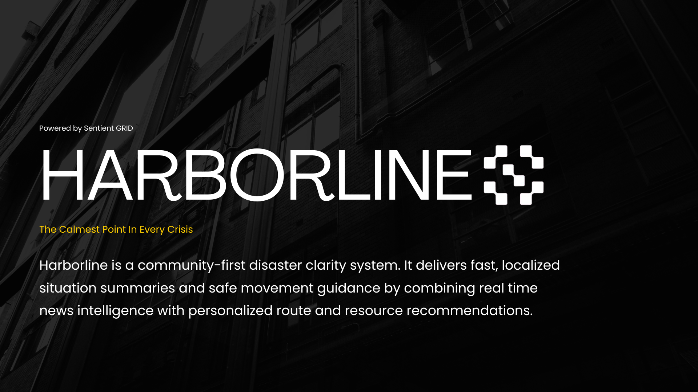
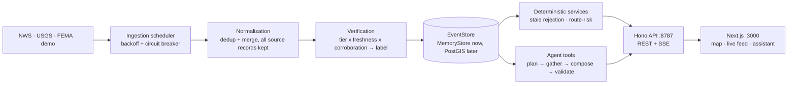

# Harborline (Best Use of the Agent @ Sentient Labs Hackathon)

<p align="center">
  
</p>

Harborline puts official alerts, open shelters, road risk, and an evidence-backed assistant in one view, built for a person who is stressed and needs a straight answer. The system is location-agnostic — all geography lives in one region config — and ships configured for California, where wildfire is a fact of life.

Disaster information is scattered across agency feeds, news, and social posts, and the tools that aggregate it tend to hallucinate at exactly the moment accuracy matters. Harborline flips the usual AI architecture. It ingests official emergency feeds into one canonical geospatial event model, with provenance and freshness on every record, and the language model can only restate what those records say. The database decides what is true; the model puts it into words. If Harborline says a shelter is open, that is because the county's emergency management agency verified it 8 minutes ago, not because a model guessed.

Built for the **Sentient Labs Hackathon (50 Selected Builders)**, where it won **Best Use of the Agent**.

<p align="center">
  
</p>

<p align="center">
  <i>Best Use of the Agent: Jacob Frans, Kshitij Rao, Gurucharan Lingamallu, Hemkesh Bandi</i>
</p>

## What Harborline does

1. **Ingest official sources.** Connectors poll NWS alerts, USGS earthquakes, and FEMA National Shelter System shelters on per-source schedules, with backoff, circuit breakers, and per-source health you can inspect at `/v1/health`.
2. **Normalize everything into one event model.** Every record becomes a `CanonicalEvent` with CAP-style severity/urgency/certainty, GeoJSON geometry, and a `SourceRecord` trail. Repeat reports of the same event merge by id with the provenance trail intact; cross-provider dedup is built and eval-tested but not yet wired into ingest (see [docs/ROADMAP.md](./docs/ROADMAP.md)).
3. **Score trust transparently.** Sources are tiered from A (issuing authority) down to E (unverified report). Internally, confidence is `authority × freshness × corroboration × precision × consistency`. Users only ever see one of four labels: `official / verified / developing / unverified`. There are no invented percentages.
4. **Enforce freshness.** Every event and resource type has a maximum acceptable age. A shelter whose status is 26 hours old still appears, along with its age, but recommendations reject it with an explicit `stale_status` reason.
5. **Route around verified hazards.** Candidate routes are intersected with hazard geometry. Routes that cross a closure or evacuation zone are eliminated, the survivors are risk-scored, and the answer is phrased as "the lowest-risk route currently available" rather than "safe".
6. **Answer questions from evidence only.** The assistant plans which tools to run, gathers structured evidence, and composes an answer from deterministic templates, or from an optional LLM for wording. A safety validator rejects any response with uncited claims, stale-as-current language, guarantees, or missing sources, and rejected answers fall back to the deterministic composer.
7. **Show contradictions honestly.** When a social post disputes an official closure, the closure stays closed and gains a `contradiction_note`. Harborline does not average sources into a false consensus.

## Why it is different

Most disaster chatbots put the model in front: they search, summarize, and hope the summary is right. Harborline puts a verified geospatial event layer in front and treats the model as a constrained interface to it, so a bad model call produces awkward wording instead of a fabricated shelter. The whole demo runs deterministically offline (`DEMO_MODE=1` seeds a California wildfire scenario over Chico), and 89 automated eval tests enforce the acceptance scenario and the hardening invariants: the stale shelter is rejected, the closed road is eliminated, and the lowest-risk route is recommended with sources and timestamps.

## Research grounding

The design and its hardening pass are grounded in a citation-verified corpus of 30 sources — OASIS/FEMA alerting standards, the NIST Camp Fire case study, the warning-message and crisis-informatics literature, and recent arXiv work on LLM safety in disaster response. Every cited source was live-fetched and checked before being relied on. [docs/RESEARCH.md](./docs/RESEARCH.md) records the twelve best-evidenced protocols, where Harborline matches them, which findings became code (the five-element warning completeness rule, the reassurance-language ban, severity-scaled hazard standoffs, read-time confidence decay), and which remain roadmap items.

## Evaluation: benchmarked against the real Camp Fire

Harborline's demo is a wildfire evacuation near Chico, Butte County. The deadliest documented event of exactly that shape happened there — the **2018 Camp Fire** (84 deaths, ~52,000 displaced, every egress artery out of Paradise closed by fire at least once). So the evaluation standard is not a synthetic rubric: it is the documented record of how that response actually unfolded, drawn from the Butte County DA's investigation, NIST TN 2252's evacuation-and-traffic analysis, and the county Grand Jury findings.

[docs/BENCHMARK.md](./docs/BENCHMARK.md) maps the real timeline onto the simulation **hour by hour** — first 911 call (06:25), fire reaching town before most evacuation orders (07:44 vs 07:46–09:03), Feather River Hospital evacuating patients mid-surgery while its roster still read "open", every egress artery closing, shelters overflowing into the Walmart parking lot — and derives **12 testable criteria** from those documented failures. An executable replay (`evals/src/real2sim-campfire.test.ts`) asserts Harborline's behavior at each mapped moment.

Current scorecard: **10 criteria met, 1 partial, 1 out-of-scope** — the convergence point for the current scope and data sources. The benchmark produces code, not just grades. Its first product is the **Feather River rule** — a fresh, nominally "open" facility located inside an active severe hazard footprint is rejected outright (`rejected_reason: "inside_hazard_zone"`), because the most dangerous record in a disaster is the one that is accurate about status and silent about geography. A maximization pass then closed three more criteria: **refuge-in-place guidance** when every route is eliminated (the NIST temporary-refuge-area pattern), an **act-now note** when a severe hazard is marked `immediate` (the fire beat Paradise's first zone order by two minutes), and **shelter health advisories plus a named plan-B destination** (norovirus ran through four "open" shelters while overflow arrivals improvised in a parking lot). A convergence pass closed two more: **green-but-empty detection** on every ingest source (per-source `last_success_records` in `/v1/health` — the silent-channel failure class of the county's undetected WEA outage) and **accessibility-aware ranking** when the question asks for it. What remains is data- or role-bound — receiver-city load balancing needs multi-town occupancy data, and contraflow is traffic command — argued row by row in the benchmark.

## Sentient technology

Harborline was designed around Sentient's open-source GRID ecosystem, and one leg of that design is now implemented: **Harborline serves as a Sentient Chat agent** through the official Sentient Agent Framework. `services/sentient-agent` is a thin Python adapter (`sentient-agent-framework` 0.3.0) that exposes the framework's SSE `POST /assist` protocol and re-emits Harborline's already-validated answers as Sentient Chat events — `EVIDENCE` (sources with tiers and ages), a streamed `ANSWER`, `ACTION`, and `CAVEATS`. No decision logic lives in the adapter; it is pure presentation over the evidence-gated pipeline. `packages/agent-tools` still defines the adapter slot where ROMA (recursive meta-agent investigations of conflicting reports) and OpenDeepSearch (open-web retrieval beyond the structured feeds) plug in behind the same tool contract — agent orchestration sits above the evidence layer; it does not replace it. [docs/SENTIENT.md](./docs/SENTIENT.md) covers the full design and current status of each integration.

## Architecture



[docs/ARCHITECTURE.md](./docs/ARCHITECTURE.md) has the full detail: trust tiers, the confidence formula, freshness tables, the route-risk pipeline, and the validator's rejection rules.

## Quick start

Requires Node 20 or newer. You don't need a database, Docker, or any API keys.

```bash
npm install
npm run build      # schema → agent-tools → connectors → api → web
npm run dev:api    # terminal 1 — API on :8787, DEMO_MODE=1 by default
npm run dev:web    # terminal 2 — web on :3000
```

Open **<http://localhost:3000>**. The seeded scenario gives you an active wildfire evacuation warning over east Chico, two road closures, three shelters (one stale, one full), and a contradicting social report. Ask the assistant *"Where is the nearest open shelter?"* and watch it reject the stale one.

## Safety principles

1. Structured records determine facts; the language layer only restates them.
2. Every displayed fact carries its provider, trust tier, and `last_verified_at` timestamp.
3. Freshness is enforced. Stale records appear with their age, but they are not recommended or described as current.
4. There is no fabrication path: missing data comes back as "unknown / not verified" instead of an inference.
5. The confidence score stays internal; users see one of four calibration-honest labels instead of a percentage.
6. Contradicting sources are shown side by side instead of being averaged.
7. The system avoids guarantee language: routes carry `"routing": "demonstration"` and hedged wording by construction.
8. The validator is the last gate. LLM output that breaks any of these rules is discarded in favor of the deterministic composer.

## Configuration

| Variable | Scope | Default | Purpose |
|---|---|---|---|
| `PORT` | `services/api` | `8787` | API port |
| `DEMO_MODE` | `services/api` | `1` in dev | Seeds the deterministic California wildfire scenario at boot; live connectors keep running. `0` for live-only |
| `ANTHROPIC_API_KEY` | `services/api` | unset | Optional. Enables the LLM composer for wording; output still passes the safety validator or is discarded |
| `ANTHROPIC_MODEL` | `services/api` | `claude-sonnet-5` | Composer model override; only read when the key is set |
| `OPENAI_API_KEY` | `services/api` | unset | Optional. Same wording-composer role via the OpenAI Responses API; used when `ANTHROPIC_API_KEY` is not set. Same validator gate and deterministic fallback |
| `OPENAI_MODEL` | `services/api` | `gpt-5.6-luna` | OpenAI composer model override; only read when that key is in use |
| `ALLOWED_ORIGINS` | `services/api` | unset | Comma-separated CORS allowlist. Unset: localhost-only in dev, deny cross-origin in production |
| `TRUST_PROXY` | `services/api` | unset | Set `1` only behind a TLS-terminating proxy: rate limiting then keys on `X-Forwarded-For` instead of the socket address |
| `NEXT_PUBLIC_API_URL` | `apps/web` | `http://localhost:8787` | REST + SSE base URL |

Geography is not scattered through the code: everything location-specific — map centre, connector bounding box, NWS alert area, shelter state filter — lives in a single `RegionConfig` at `packages/event-schema/src/region.ts`. The default region is California, centred on Chico (Butte County). To point Harborline at a different area, change that one file; the seeded demo scenario and the demonstration road graph share the Chico geography and would be re-authored alongside it.

## Commands

| Command | Description |
|---|---|
| `npm run dev:api` | Run the API with the seeded demo scenario on `:8787` |
| `npm run dev:web` | Run the web app on `:3000` |
| `npm run build` | Build every workspace in dependency order |
| `npm run check` | `tsc --noEmit` across all workspaces |
| `npm test` | 89 Vitest evals: safety validator, dedup, freshness, hardening invariants, acceptance scenario, Camp Fire real-to-sim benchmark |

## Project layout

| Path | What |
|---|---|
| `packages/event-schema` | The canonical contract: `CanonicalEvent`, `SourceRecord`, `Resource`, routing types, confidence + freshness policy, `Connector` interface |
| `packages/agent-tools` | `EventStore`/`MemoryStore`, tool registry, query planner, composer, optional LLM wrapper, safety validator, route-risk engine |
| `connectors` | NWS, USGS, FEMA shelters, and the seeded demo scenario |
| `services/api` | Hono REST + SSE + ingestion scheduler |
| `services/sentient-agent` | Python adapter serving Harborline as a Sentient Chat agent (Sentient Agent Framework, SSE `POST /assist`) |
| `apps/web` | Next.js 16 UI: MapLibre dark map, live feed, assistant |
| `evals` | Vitest suites for safety, dedup, freshness, and the end-to-end scenario |
| `infrastructure` | Optional PostGIS + Redis compose stack for the upgrade path |
| `docs` | [Build guide](./docs/BUILD_GUIDE.md) · [plan evaluation](./docs/PLAN_EVALUATION.md) · [architecture](./docs/ARCHITECTURE.md) · [API reference](./docs/API.md) · [runbook](./docs/RUNBOOK.md) · [roadmap](./docs/ROADMAP.md) · [research grounding](./docs/RESEARCH.md) · [Camp Fire benchmark](./docs/BENCHMARK.md) · [Sentient integration](./docs/SENTIENT.md) |

## Built with

TypeScript end to end: Next.js 16, React 19, Tailwind 4, MapLibre GL, TanStack Query, Hono, Zod 4, Vitest. Basemap tiles © CARTO, © OpenStreetMap contributors. Alert data © NOAA/NWS, USGS, and FEMA/American Red Cross, each retained with its source record. Designed around Sentient's open-source GRID ecosystem (ROMA, OpenDeepSearch) via the adapter boundary in `packages/agent-tools`.

## License

MIT. See [LICENSE](LICENSE).

---

> **Note on the revamp.** This repository is a ground-up rebuild of the original
> Sentient Labs hackathon project. The hackathon version proved the concept and won
> the award. The rebuild brings it up to current engineering and research practice:
> an evidence-first architecture with provenance and freshness on every record, a
> safety validator gating all model output, 89 automated evals including the full
> acceptance scenario, a research-driven security and correctness hardening pass
> (rate limiting, bounded SSE, store lifecycle, prompt-injection defenses,
> read-time confidence decay, the five-element warning rule — see
> [docs/RESEARCH.md](./docs/RESEARCH.md)), and documentation grounded in the
> current upstream Sentient stack ([docs/SENTIENT.md](./docs/SENTIENT.md))
> rather than hackathon-week memory.
